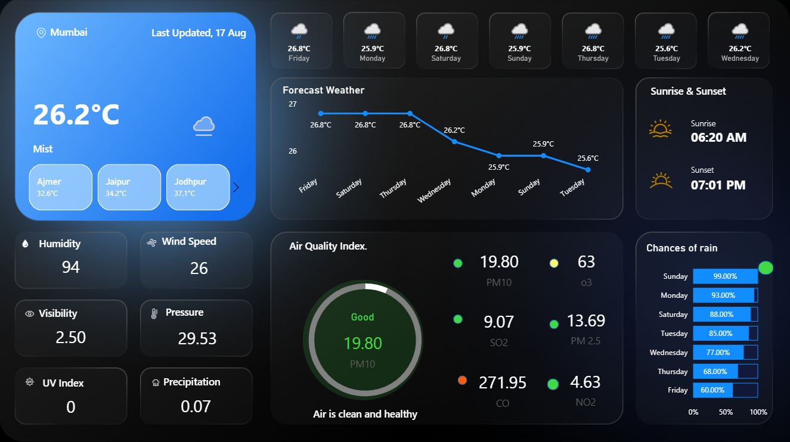

# 🌦️ Power BI Weather Forecast & Current Weather Dashboard

This project is an **interactive Power BI dashboard** that visualizes both **current weather conditions** and **forecast trends** using data from a **Weather API**.  
It demonstrates how real-time data can be transformed into meaningful insights with engaging visuals.

---

## 📊 Dashboard Overview

The dashboard includes:
- **Current Weather** – Temperature, Humidity, Wind Speed, and Conditions (Sunny, Rainy, Cloudy, etc.).
- **Forecast Analysis** – 5-day or 7-day weather trends with visual charts.
- **Comparisons** – View temperature variations, humidity levels, and wind patterns over time.
- **Interactive Filters** – Choose a city/region to get live updates.

---

## 🔗 Data Source

- The data is fetched from a **Weather API** (e.g., [OpenWeather API](https://openweathermap.org/api))  
- API provides:
  - Current weather by location
  - Hourly/Daily forecast
  - Weather condition codes & icons  

This data is then imported into **Power BI**, transformed, and visualized.

---

## 🛠️ Tools & Technologies

- **Power BI Desktop** – For building the dashboard.
- **Weather API** – To fetch real-time and forecast weather data.
- **Power Query** – For ETL (Extract, Transform, Load) process.
- **DAX** – For creating measures and calculations.

---

## 📷 Dashboard Preview

  

---

## 🚀 How to Use

1. Clone this repository:
   ```bash
   git clone https://github.com/AnkitBalotiya/POWERBI_WEATHER_DASHBOARD.git
